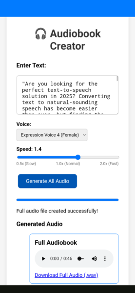

# Audiobook Creator

A lightweight, offline-first Text-to-Speech web application that runs entirely in the browser. This Progressive Web App (PWA) is designed to be installed on a mobile device, allowing users to generate audio from text without needing a constant internet connection.

## About the Project

The goal of this project was to create a privacy-focused and highly accessible tool for converting text into an audiobook format. By leveraging a local AI model that runs directly on the user's device, all text processing and audio generation happens locally. This ensures that the user's text is never sent to a server.

Once installed, the application and its AI model are cached for full offline functionality.

## Key Features

*   **Offline First:** After the initial load and installation, the entire application runs without an internet connection.
*   **Installable:** As a Progressive Web App, it can be installed to your phone's home screen for a native app-like experience.
*   **Share Target Functionality:** The app integrates with the operating system's share sheet, allowing you to send text directly from websites, e-books, or other applications.
*   **No Server-Side Processing:** All TTS conversion happens in your browser, ensuring user privacy.
*   **Gapless Audio:** Audio chunks are stitched together with a crossfade effect to eliminate clicks and pops between sentences.
*   **Responsive UI:** The interface remains responsive during processing, showing a progress bar and an estimated time remaining.

## Installation and Usage

This application is designed to be installed from a web browser onto a mobile device.

1.  Navigate to the application's hosting URL.
2.  Your browser should provide an option to **"Install app"** or **"Add to Home Screen"**.
3.  **Note on Browser Compatibility:** For the best experience with installation and the share target feature, using **Google Chrome on Android** is recommended. While the app may function in other browsers like Brave, the PWA integration is most reliable and tested on Chrome.
4.  Once installed, you can open the app from your home screen. To generate audio, either paste text directly into the text area or use the "Share" function from another app and select "Audiobook Creator" from the list.

## Technology Stack

*   **TTS Engine:** The core text-to-speech conversion is powered by **KittenTTS**, a lightweight and high-quality TTS model.
*   **ONNX Runtime Web:** Used to run the KittenTTS (`.onnx`) model directly in the browser using WebAssembly.
*   **Progressive Web App (PWA):**
    *   A **Service Worker** manages the caching of all application assets for offline use.
    *   A **Web App Manifest** provides the metadata for installation and registers the application as a share target.
*   **Web Audio API:** Used for advanced audio manipulation, specifically to apply a crossfade between audio segments for seamless playback.
*   **Vanilla JavaScript:** The application is built without any front-end frameworks, focusing on performance and direct use of browser APIs.

## Acknowledgments and Credits

This project would not have been possible without the following open-source work and assistance:

*   **TTS Engine:** Credit goes to the creators of **KittenTTS** for developing the powerful and efficient TTS model used in this application.
    *   [https://github.com/KittenML/KittenTTS](https://github.com/KittenML/KittenTTS)

*   **Reference Implementation:** The initial architecture and a key understanding of how to run the model in a web environment were based on the excellent work from the KittenTTS web demo.
    *   [https://github.com/clowerweb/kitten-tts-web-demo](https://github.com/clowerweb/kitten-tts-web-demo)

*   **Application Development:** The complete JavaScript application logic, front-end interface, Progressive Web App implementation (including the service worker and manifest), and all debugging and feature development were coded by **Google's Gemini assistant**.